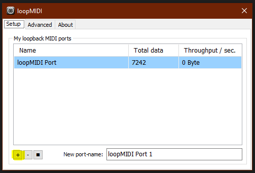
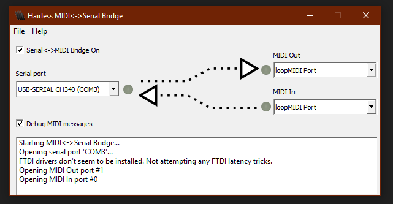
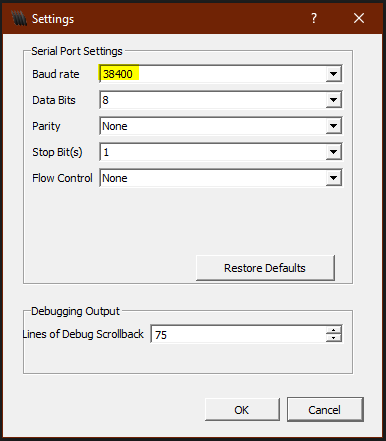
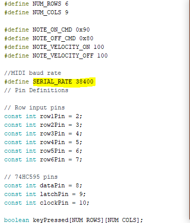

# MIDI-Synthesizer
Transforming old synthesizer into MIDI device
---
**Version 1.0.0**

At this stage the MIDI device 5 din connector doesn't work therefore the Serial-MIDI bridge can't be done,  the solution for this problem at the moment is a virtual Serial-MIDI bridge. For this I included two simple applications.  One for virtual MIDI In/Out Port and one for the virtual Serial-MIDI bridge.

---
Included Files:
---
```
MIDI_Keyboard //arduino project folder

hairless-midiserial // virtual Serial-MIDI bridge program

loopMIDISetup.exe // virtual MIDI In/Out Port program executable
```

---
**1. Virtual MIDI In/Out Port setup:**
---
Start the [loopMIDISetup.exe](https://github.com/YelIowFox/MIDI-Synthesizer.git) and follow the steps through the installation. After the installation is finished  open the application and select the setup box. Create new virtual MIDI In/Out Port by clicking the '+' button.



You can download newer version of the program [here](https://www.tobias-erichsen.de/software/loopmidi.html).

---
**2. Virtual Serial-MIDI bridge setup:**
---
* Copy the [ardumidi](hairless-midiserial) folder to your arduino library folder
* Start [hairless-midiserial.exe](hairless-midiserial) and select as follows:  
Serial port - port of arduino *// in this case "COM3"*  
MIDI In/Out - virtual MIDI In/Out Port *// "loopMIDI Port"*
  
Newer version of the program [here](http://projectgus.github.io/hairless-midiserial/)
* Make sure that the [baud rate of the arduino](MIDI_Keyboard/MIDI_Keyboard.ino) and the Hairless MIDI are the same:

 

You can access the settings tab of the Hairless MIDI by:  
File-->Preferences

---
